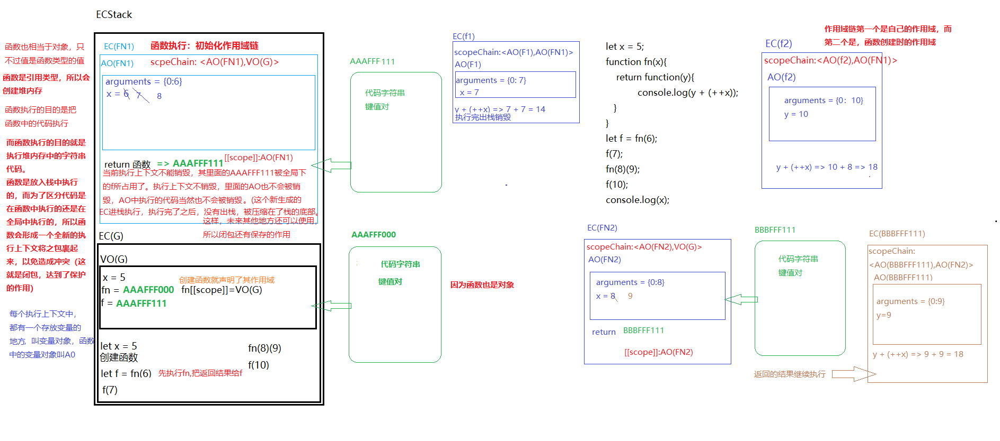

# 闭包
关于闭包这个概念，我也看了一些教程，博客，查阅了一些资料，感谢网上许多大佬对知识的共享。这章我就闭包而言进行一个总结。  
我对闭包的切入点是：从哪来，是什么。  

## 闭包从哪来
Peter J. Landin 在1964年,引入了 [闭包](https://en.wikipedia.org/wiki/Closure_(computer_programming)#History_and_etymology)(需要vpn) 一词来指代 `lambda` 表达式(也称 [λ表达式](https://en.wikipedia.org/wiki/Lambda_calculus#Free_and_bound_variables)),该表达式的 <font color="#FA8072">自由变量</font> 被绑定到词法环境中，从而会导致了封闭表达式或闭包。在  Peter J. Landin 的论文中，还有着对于闭包比较确切的描述：<font color="#000000">**包含了一个λ表达式(匿名函数)和它所被计算所需的相关环境**</font>。
所以说，要认识并理解到闭包这个概念还要从λ表达式说起，λ表达式的发明者是 alonzo church , 简单的λ演算语法分为三个部分：
> 1. 变量
> 2. 抽象
> 3. 应用

**变量**    
数学形式：一个符号。  
JavaScript中：一个标识符    
<font color="#3EAF7C">**约束变量**</font>：绑定了值的变量  
<font color="#3EAF7C">**自由变量**</font>：未绑定值的变量  

**抽象(定义函数)**   
比如：输入一个值，输出这个值加1后的值   

数学形式：`F(x) = x + 1`  
JavaScript： `x => x+1` (以箭头函数的形式)，相当于：
```js
function fn(x){
	return x + 1;
}
```
λ表达式： `λx.x+1` 

**应用(调用函数)**   
比如：传入一个2并执行 

数学形式： `F（2）`  
JavaScript: `(x => x + 1)(2)`
```js
(function fn(x){
	return x + 1;
})(2)
```
λ表达式： `（λx.x+1）2`  

有一个例子：
```js
//js的写法： 
(x=>y=>x+y)(2)(1);

//λ表达式的写法：
(λx.(λy.x+y)2)1
```
对于上面的例子，变量 <font color="#FA8072">x</font> 以及变量 <font color="#FA8072">y</font> 都已经获得了一个绑定的值，所以这个表达式中不存在自由变量，这种表达式实际上就是一个<font color="#3EAF7C">**闭合表达式**</font>

那么对于 <font color="#FA8072">(λx.x+y)1</font> ，在只知道 <font color="#FA8072">x</font>获得了绑定值的这种表达式，<font color="#FA8072">y</font> 就是一个自由变量，这种表达式就是一个<font color="#3EAF7C">**开放表达式**</font>。对于这种情况，假设 <font color="#FA8072">y</font> 是存在的，只是不在这个表达式中，那么如何得到 <font color="#FA8072">y</font> 的值从而计算出这个开放表达式的值呢？这就需要引入闭包的概念。

## 闭包是什么
对于上面问题的解决方法，预先定义一个<font color="#3EAF7C">**环境**</font>，使得表达式中的每一个<font color="#3EAF7C">**自由变量**</font>都得到了一个绑定值。从而开放表达式变成了一个<font color="#3EAF7C">**闭合表达式**</font>，这样就构建了一个闭包。

进行归纳后，如下：
:::tip
1. 闭包 = 开放表达式 + 使得开放表达式闭合的一个环境  

2. 闭包 = 函数 + 使得函数中每一个自由变量都获得绑定值的一个环境

3. 闭包 = 函数 + 环境  
函数是包含自由变量的函数  
环境是使所有自由变量都获得绑定值的环境  
:::
再来看看书中，以及 MDN 对闭包的解释：

>1. 在《Head First JavaScript程序设计》中，对闭包的解释是：包含 <font color="#3EAF7C">**自由变量**</font> 的函数与为所有这些自由变量提供了 <font color="#3EAF7C">**变量绑定的环境**</font> 一起，被称为闭包。

>2. 在 《你不知道的JavaScript》中，对闭包的解释是：当函数可以记住并访问所在的 <font color="#3EAF7C">**词法作用域**</font> 时，就产生了闭包。

>3. 在《JavaScript高级程序设计》中，对闭包的解释是：闭包是指有权访问另一个函数作用域中的变量的函数。

>4. 在 MDN 中，对闭包的解释是：函数和对其周围状态（`lexical environment`，词法环境）的引用捆绑在一起构成闭包（`closure`）。也就是说，闭包可以让你从内部函数访问外部函数作用域。在 JavaScript 中，每当函数被创建，就会在函数生成时生成闭包。

由此可见，在《《Head First JavaScript程序设计》》这本书以及 MDN 中有着对于闭包更为贴切的解释。

贴点代码加点点缀：
```js
<ul>
	<li>a</li>
	<li>b</li>
	<li>c</li>
</ul>
<script>
let oli = document.getElementsByTagName('li');
for(var i = 0; i < oli.length; i++){
	oli[i].onclick = function(){
		console.log(i);
	}
}
</script>
```
上面的代码，毫无疑问，无论点击哪个 <font color="#FA8072">li</font> 最终的结果都是3。这是因为，当执行方法，形成一个私有栈内存，遇到变量 <font color="#FA8072">i</font>,<font color="#FA8072">i</font> 是自由变量，通过作用域查找机制，向上级作用域查找(上级作用域window)  
当点击 <font color="#FA8072">li</font> 的时候，外层循环已经结束(点击li的时候页面已经加载完毕，页面加载完成预示着js代码都已经执行完成)，外层循环结束已经让全局下的 <font color="#FA8072">i</font> 等于 <font color="#FA8072">li</font> 的总长度

对于这个问题的解决方法有很多，这里用闭包来解决:
```js
let oli = document.getElementsByTagName('li');
for(var i = 0; i < oli.length; i++){
    (function(i){
	oli[i].onclick = function(){
		console.log(i);
    }
   })(i)
}
```
最后来一个脑筋急转弯暂时结束闭包这个话题：
<a data-fancybox title="image" href="/blog/assets/img/bibao.36c36ec5.jpg"></a> 

