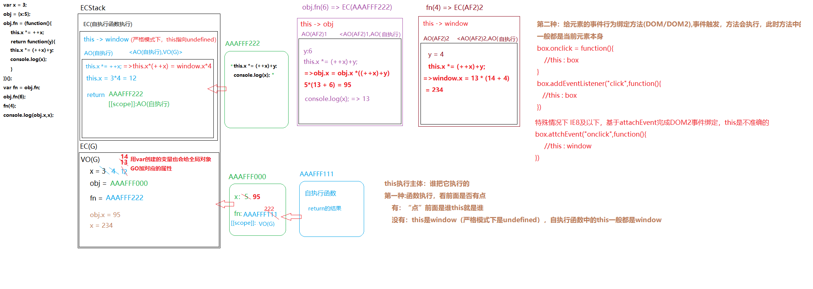

# this
这章我准备自己提炼总结一下this，来对它的来龙去脉有个更加清晰的认识，以及几种运用场景。

## this的由来
当一个函数被调用时，会创建一个执行上下文(或者说活动记录)。这个记录会包含函数在哪里被调用，函数的调用方式，传入的参数等信息。<font color="#FA8072">this</font> 就是这个记录的一个属性，会在函数执行的过程中用到。

实际上对于 <font color="#FA8072">this</font> 的绑定一句话就可以概括， <font color="#FA8072">this</font> 是在函数被调用时发生的绑定，它指向什么完全取决于在哪里被调用。

## 默认绑定
```js
function fn(){
	console.log(this) 
};
fn();  //window 
```
上面这个例子，当执行函数的时候应用了 <font color="#FA8072"> this</font> 的默认绑定，因此此时 <font color="#FA8072"> this</font> 指向 <font color="#FA8072"> window</font>

如果使用 <font color="#3EAF7C">**严格模式**</font>(strict mode),则不能将全局对象用于<font color="#3EAF7C">**默认绑定**</font>，因此 <font color="#FA8072">this</font> 会绑定到 <font color="#FA8072">undefined</font>,如下：
```js
function fn(){
    'use strict'
	console.log(this) 
};
fn();   //undefined
```

## 隐式绑定
```js
function fn(){
	console.log(this.a);
}

let obj = {
	a: 1,
	fn
};

obj.fn();   //1
```
对于上面的例子，当函数引用有上下文对象时，<font color="#3EAF7C">**隐式绑定**</font>规则会 把函数调用中的 <font color="#FA8072">this</font> 绑定到这个上下文对象。调用函数时 <font color="#FA8072">this</font> 被绑定到 <font color="#FA8072">obj</font> 上，因此 <font color="#FA8072">this.a</font> 和 <font color="#FA8072">obj.a</font >是一样的

### 隐式丢失
一个最常见的 <font color="#FA8072">this</font> 绑定问题就是被隐式绑定的函数会丢失绑定对象，也就是说它会应用 <font color="#3EAF7C">**默认绑定**</font>，从而把 <font color="#FA8072">this</font> 绑定到全局对象或者 <font color="#FA8072">undefined</font> 上，这取决于是否是严格模式。  
如下：
```js
function fn(){
    console.log(this.a);
}

let obj = {
    a : 1,
    fn
}

var foo = obj.fn; //函数起别名
var a = 'global'; //a是全局对象的属性

foo();
```
上面例子，虽然 <font color="#FA8072">foo</font> 是 <font color="#FA8072">obj.fn</font> 的一个引用，但实际上引用的是函数本身，当 <font color="#FA8072">foo()</font> 执行的时候，会应用 <font color="#3EAF7C">**默认绑定**</font>。

还有一个例子：
```js
function fn1(){
	console.log(this.a)
}
function fn2(fn){
	fn();
}
let obj = {
	a : 1,
	fn1
}

var a = 'global';

fn2(obj.fn1);
```
上面代码 函数 <font color="#FA8072">fn2</font> 函数调用的时候，将 <font color="#FA8072">obj.fn1</font> 作为参数传递，在函数 <font color="#FA8072">fn2</font> 中执行 函数 <font color="#FA8072">fn</font> ，相当于执行函数 <font color="#FA8072">fn1</font> ,而此时注意函数的调用位置，会应用默认绑定。

## 显示绑定
JavaScript提供的绝大多数函数以及自己创建的函数都可以使用 <font color="#FA8072">call</font> 和 <font color="#FA8072">apply</font> 方法。这两个方法的作用就是，可以直接指定 this 的绑定对象，因此称之为显示绑定。

如创建一个可以重复使用的辅助函数：
```js
function foo(arg){
    console.log(this.a,arg);
    return this.a + arg;
}
//简单的辅助绑定函数
function bind(fn,obj){
    return function(){
        return fn.apply(obj,arguments);
    }
}
let obj = {
    a : 1
};

let bar = bind(foo,obj);
let b = bar(2); //1,2
console.log(b); //3
```
首先,调用 <font color="#FA8072">bind()</font>，返回给 <font color="#FA8072">bar</font> 一个函数，调用 <font color="#FA8072">bar()</font>,并传入一个2,<font color="#FA8072">apply</font> 方法执行，将 <font color="#FA8072">fn</font> 的 <font color="#FA8072">this</font> 指向 <font color="#FA8072">obj</font>, <font color="#FA8072">arguments[0] = 2</font>,然后执行 <font color="#FA8072">fn</font>。

上面这种现实绑定是一个变种，这种绑定是一种显式的强制绑定，因此称为 <font color="#3EAF7C">**硬绑定**</font>。由于硬绑定是一种非常常用的模式，所以ES5提供了内置的方法 <font color="#FA8072">Function.prototype.bind</font>，<font color="#FA8072">bind()</font> 方法创建一个新的函数，在 <font color="#FA8072">bind()</font> 被调用时，这个新函数的 <font color="#FA8072">this</font> 被指定为 <font color="#FA8072">bind()</font> 的第一个参数，而其余参数将作为新函数的参数，供调用时使用。它的用法如下：
```js
function foo(something){
    console.log(this.a, something);
    return this.a + something;
}
let obj = {
     a : 1
};

let bar = foo.bind(Obj);
let b = bar(2); //1,2
console.log(b); //3
```

## new 绑定
说到 <font color="#FA8072">new</font> 绑定就不得不提前说一下构造函数，构造函数执行，在js代码自上而下执行之前，会首先在当前形成的私有栈内存中创建一个对象，暂时不存储任何东西，并且让函数中的执行主体 <font color="#FA8072">this</font> 指向这个对象,在代码执行完成之后，在把之前创建的对象返回出去。<font color="#FA8072">new </font> 是最后一种可以影响函数调用时 <font color="#FA8072">this</font> 绑定行为的方法，称之为 <font color="#FA8072">new</font> 绑定。如下:
```js
function fn(a){
    this.a = a;
};
let bar = new fn(1);
console.log(bar.a); //1
```
最后来一个脑筋急转弯结束 <font color="#FA8072">this</font> 这个话题：
<a data-fancybox title="image" href="/blog/assets/img/this.6cedc24f.jpg"></a>