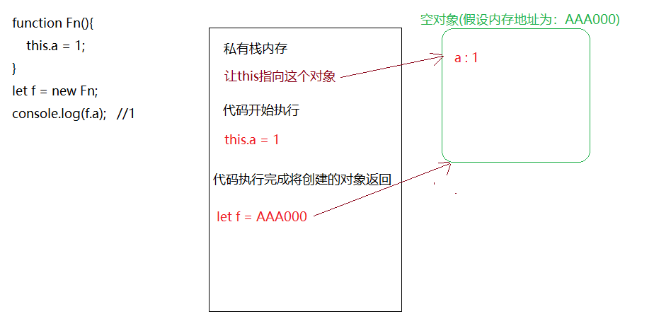
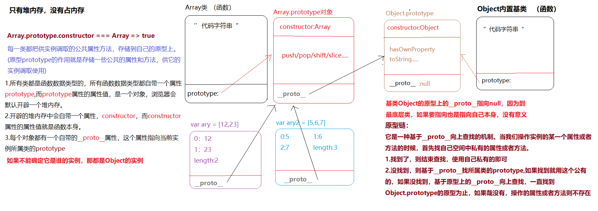
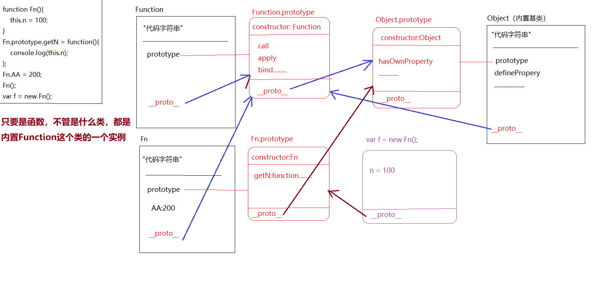

# 对象&类&函数
可以先看看es5中如何通过 <font color="#3EAF7C">**构造函数**</font>生成 <font color="#3EAF7C">**实例对象**</font> 。
```js
function Fn(){
    this.a = 1;
}
let f = new Fn;
console.log(f.a);   //1
```
上面有提到 <font color="#3EAF7C">**构造函数**</font>和 <font color="#3EAF7C">**实例对象**</font>，那这两者又是什么呢。
## 构造函数与实例对象
我对构造函数的理解是：构造函数从表现形式来说的话，就是执行的时候 <font color="#FA8072">new</font> 执行，函数变成一个类，而返回结果就是类的一个实例。 
  
（2020.8.14,通过查阅 <font color="#FA8072">ECMAScritp262</font> 后得知构造函数的由来，其实构造函数的另外两种官方名称是 <font color="#3EAF7C">**构造器**</font> 或者<font color="#3EAF7C">**构造函数对象**</font>。而构造函数依赖于两种内置方法 `[[Call]]` 和 `[[Construct]]`。支持内部方法 `[[Call]]` 的对象就叫做<font color="#3EAF7C">**函数对象**</font>,支持 `[[Construct]]` 内部方法的对象叫做构造器，而支持 `[[Construct]]` 的每个对象都必须支持 `[[Call]]`。也就是说，每个构造器都必须是一个函数对象。所以构造器也可以称为构造函数或构造函数对象。）


那么 <font color="#FA8072">new</font> 调用的函数在调用时经历了什么？  或者说构造函数的执行步骤是什么？  
> 1. 像普通函数执行一样，形成私有作用域。
> 2. 在js代码自上而下执行之前，首先会在当前形成的私有栈中创建一个空对象，并让函数中的执行主体 this 指向这个对象。
> 3. 代码开始自上而下执行。
> 4. 代码执行完成，把之前创建的对象地址返回。

如图：
<a data-fancybox title="构造函数" href="/blog/assets/img/constructor.f7283cf3.jpg"></a>
由此可以得出，开始创建的对象其实就是当前 <font color="#FA8072">Fn</font> 这个类的一个实例，让 <font color="#FA8072">this</font> 指向这个实例，就相当于代码执行中 `this.xxx =xxx` 都是在给实例设置 <font color="#3EAF7C">**'私有属性'**</font>，最后浏览器会把默认创建的实例返回，供外面接收。

再次执行  `new Fn` ,就是把上面的操作克隆一份，会形成新的实例(新的内存空间，堆内存)，所以说实例的特性是 <font color="#3EAF7C">**独立分开**</font> 的。如下：
```js
function Fn(){
    this.a = 1;
}
let f = new Fn;
f.a = 2;

let f1 = new Fn;

console.log(f.a);	// 2
console.log(f1.a);	// 1
```
:::warning
构造函数执行，如果不写 return ，浏览器会默认返回创建的实例，但是如果写了 return，就有两种情况：
1. return 是一个基本值，返回的结果依然是类的实例，没有受到影响。  
2. 如果返回的是引用值，则会把默认返回的实例覆盖，此时接收到结果就不再是当前类的实例。
:::
如下：

```js
//return 基本值
function Fn(){
    this.a = 1;
	return 2;
}
let f = new Fn;
console.log(f.a);	//1

//return 引用值
function Fn(){
    this.a = 1;
	return {b:1};
}
let f = new Fn;
console.log(f.a);	//undefined
console.log(f.b);	//1
```
## 单例设计模式(singleton pattern)
对于实例的特性是单独分开的，可以引申出一个知识点：单例设计模式。

可以先看看单例设计模式的表现形式是怎样的。
```js
let obj = {};   //没错这就是单例设计模式
```
对于单例设计模式来说，它的作用就是把描述同一件事物的属性和特征进行分组，归类(存储在同一个堆内存空间中，因此避免了全局变量之间的冲突和污染)。

在单例设计模式这种构造模型当中， <font color="#FA8072">obj</font> 不仅仅是对象名，它也被称为<font color="#3EAF7C">**命名空间**</font>，<font color="#FA8072">[namespace]</font>,把描述事物的属性存放到命名空间中，多个命名空间是独立的，互不冲突，所以称为单例。

**高级单例模式**  

这种模式的用法是：在给命名空间赋值的时候，不是直接赋值一个对象，而是先执行匿名函数，形成一个私有作用域(不销毁的栈内存)，在这个私有作用域中创建了一个堆内存，把堆内存地址赋值给命名空间。如下：

```js
let nameSpace = (function(){
	function fn(){
					
	}
	reutrn {
	fn: fn
	}
})()
```
这种模式的好处：可以在私有作用域中创造很多内容(变量，函数)，哪些需要供外面调取使用的，我们暴露到返回的对象中(模块化实现的一种思想)

## 原型与[[Prototype]]链
回归正题，之前解释了 ES5 的构造函数，现在在来看看 ES6 的实现手法。ES6 提供了更接近传统语言的写法，引入了 <font color="#FA8072">Class</font>（类）这个概念，作为对象的模板。通过<font color="#FA8072">class</font> 关键字，可以定义类。

基本上，ES6 的 <font color="#FA8072">class</font> 可以看作只是一个语法糖，它的绝大部分功能，ES5 都可以做到，新的 <font color="#FA8072">class</font> 写法只是让对象原型的写法更加清晰、更像面向对象编程的语法而已。如下：

```js
class Fn{
    constructor(a){
        this.a = a;
    }
}
let f = new Fn(1);
console.log(f.a);
```
可以看到上面代码中出现了一个叫 <font color="#FA8072">constructor</font>的单词，那这个又是什么呢？ 

这要从函数开始说起，所有的类都是函数，这是毋庸置疑的，而所有的函数的都有一个内置的属性叫做， <font color="#FA8072">prototype</font>，这个属性的属性值是一个对象，而这个对象的作用就是 <font color="#000000">**存储了当前类供实例调取使用的属性和方法。**</font>在这个对象中还有一个内置的属性叫做 <font color="#000000">**constructor**</font>，这个属性的属性值指向的就是函数本身。

供实例调取使用的属性和方法也被称为：<font color="#3EAF7C">**公有属性**</font> 和   <font color="#3EAF7C">**公有方法**</font>。  
那么实例怎么调取使用这些属性和方法呢？  

这就要从对象开始说起，实例就是对象，这是毋庸置疑的，所有的对象都有一个内置的属性叫做：`__proto__`,   而这个 `__proto__` 属性<font color="#000000">**指向的就是当前实例所属类的原型**</font>。如下：
```js
function Fn(){
	this.a = 1;
	Fn.prototype.name = 'xiaoming';
}
let f = new Fn;

console.log(f.__proto__.name);	//xiaoming
console.log(f.name);			//xiaoming
```
上面代码可以看到 打印 <font color="#FA8072">f.name</font> 也是打印出 <font color="#FA8072">'xiaoming'</font>，这实际上是通过 `[[Prototype]]` 链实现的。 当引用对象的属性，如 <font color="#FA8072">f.name</font> ，会触发 `[[Get]]`操作。对于默认的 `[[Get]]` 操作来说，第一步就是检查对象本身是否有这个属性，如果有就使用它。如果没有就会使用对象的 `__proto__` 属性通过 `[[Prototype]]` 链机制，在当前实例所属类的原型中查找，找到了的话就使用它。如果还没有找到，就会继续向上查找，最终会找到内置基类 <font color="#FA8072">Object</font> 的原型，还没有如 <font color="#FA8072">name</font> 这个属性的话，就会返回 <font color="#FA8072">undefined</font>。

如图(另一个例子，与上面代码不同)：

<a data-fancybox title="prototype" href="/blog/assets/img/prototype.be34db90.jpg"></a>
:::danger
实际上，在 [MDN](https://developer.mozilla.org/zh-CN/docs/Web/JavaScript/Reference/Global_Objects/Object/proto) 中有明确规定：  
`Object.prototype.__proto__`已经从 Web 标准中删除。但它被大多数浏览器厂商所支持的今天，其存在和确切行为仅在 ECMAScript 2015 规范中被标准化为传统功能，以确保Web浏览器的兼容性。所以不再建议使用此属性，取而代之的是建议只使用 `Object.getPrototypeOf()`。
:::

## 函数即对象
总结了这么多，其实还差一个画龙点睛之笔，就可以拉通对象&类&函数三者之间的关系了。如下：
```js
function fn(){

};
fn.a = 1;
console.log(fn.a)   //1
```
上面代码中表示的含义已经显而易见了，函数也是对象，因此可以对，对象&类&实例有一个等级划分：
>对象：万物皆对象  
>类：对象的具体细分  
>实例：类中具体的一个事物  

实际上所有的函数都是Function的实例。也就是说，所有的函数也会有 `__proto__` 这个属性。

如图(另一个例子)：

<a data-fancybox title="prototype" href="/blog/assets/img/funobj.b3434f97.jpg"></a>

